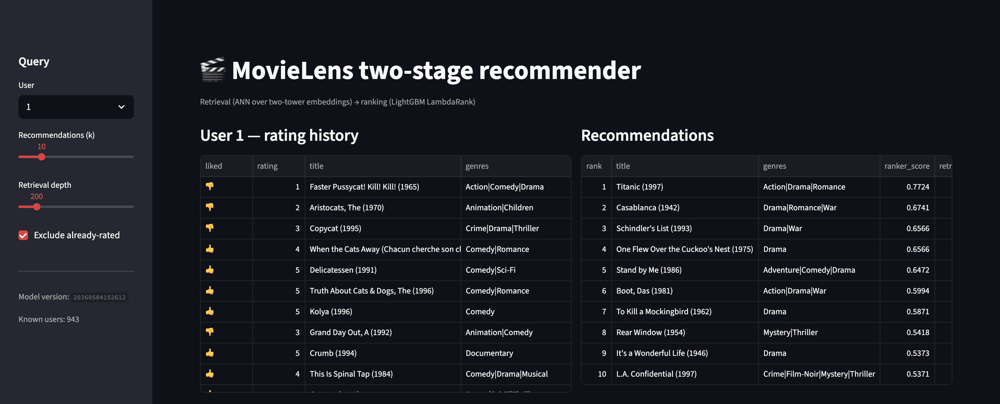
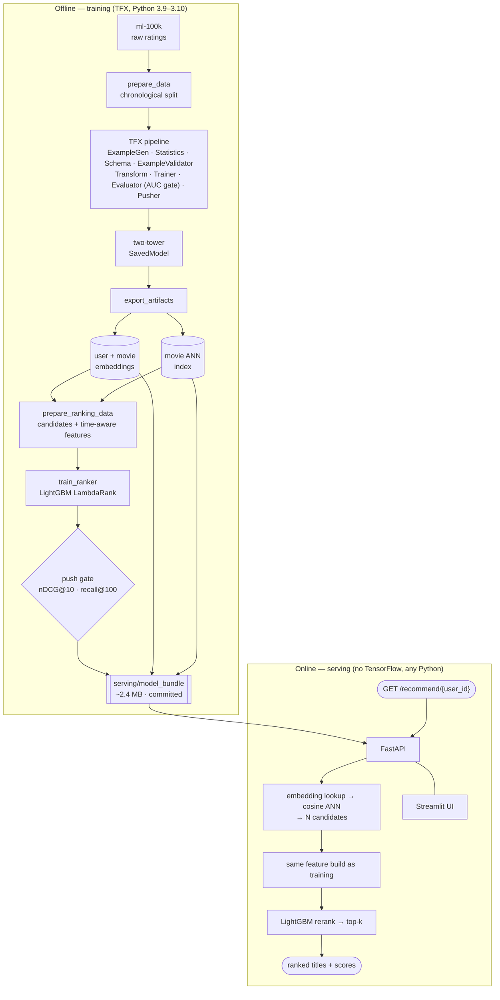

# MovieLens Two-Stage Recommender

[](https://github.com/JShi12/movie-recommender/actions/workflows/ci.yml)


[](https://movie-recommender-ui-mvs3.onrender.com/)

**Live demo: [movie-recommender-ui-mvs3.onrender.com](https://movie-recommender-ui-mvs3.onrender.com/)**
(free tier — sleeps after ~15 min idle, first load can take 30-60s to wake up)

A production-shaped **retrieval → ranking** recommender on MovieLens 100k:

- **Retrieval** — a [TFX](https://www.tensorflow.org/tfx) pipeline trains a two-tower
  TensorFlow model; exported tower embeddings + an approximate-nearest-neighbour index
  turn "1,682 movies" into "~200 candidates per user".
- **Ranking** — a LightGBM LambdaRank model reranks those candidates using time-aware
  behavioural features and the retrieval embeddings.
- **Serving** — a FastAPI service does embedding-lookup → ANN → LightGBM rerank with
  **no TensorFlow at request time** (~70 ms/request), plus a Streamlit demo UI.

Everything runs from a fresh clone with `make setup && make demo` — a ~2.4 MB model
bundle is committed so the demo needs no training.



## Architecture



The offline pipeline is also compiled to Kubeflow Pipelines packages
(`make compile-pipelines`) for cluster execution.

## Results

Held-out **chronological** test split (153 users, most recent ratings). Regenerate with
`make eval`; numbers move slightly run to run.

**Retrieval** — is the relevant movie in the candidate set?

| candidates / user | recall | hit-rate | catalogue coverage |
|---:|---:|---:|---:|
| 200   | 0.30 | 0.82 | 0.69 |
| 500   | 0.56 | 0.90 | 0.87 |
| 1000  | **0.84** | **0.97** | 0.98 |

**End-to-end** (retrieval + LightGBM rerank) — is it near the *top*?

| k | nDCG@k | recall@k | hit-rate@k |
|---:|---:|---:|---:|
| 10  | 0.20 | 0.07 | 0.61 |
| 20  | 0.20 | 0.12 | 0.69 |
| 100 | 0.27 | 0.42 | 0.87 |

Reranking lifts nDCG@10 from **0.16** (retrieval order) to **0.20**, and candidate
AUC to **0.80**.

## Quickstart

Try it live: **[movie-recommender-ui-mvs3.onrender.com](https://movie-recommender-ui-mvs3.onrender.com/)**.
To run it yourself:

```bash
make setup      # pip install -e ".[dev,serve,ui]" + pre-commit  (Python 3.9+)
make demo       # docker compose: API on :8000, UI on :8501
```

Or without Docker:

```bash
make serve      # FastAPI on :8000   (uvicorn serving.app:app)
make ui         # Streamlit on :8501 (in another shell)
```

```bash
curl "localhost:8000/recommend/1?k=5"
# → Titanic (1997) · Casablanca (1942) · Schindler's List (1993) · …
```

| Endpoint | |
|---|---|
| `GET /recommend/{user_id}?k=&n_candidates=&exclude_seen=` | ranked recommendations |
| `GET /users/{user_id}/history` | that user's rated titles + liked flag |
| `GET /users` · `GET /model` · `GET /healthz` | catalogue of user ids · model version + offline metrics · liveness |

### Retraining

The TFX retrieval stack is pinned to **Python 3.9–3.10** (TFX 1.14). Install it
separately and rebuild the bundle:

```bash
make setup-pipeline           # pip install -e ".[pipeline,dev]"
make data && make retrieval   # TFX pipeline + export embeddings/ANN index
make ranking && make eval     # LightGBM ranker + offline metrics
make bundle                   # refresh serving/model_bundle/
```

## How it works

**Leakage control.** The split is chronological and a timestamp never straddles a
partition boundary (`shared.movielens.time_based_split`). Every behavioural feature is
a *pre-event* cumulative statistic — `user_avg_rating_before`, `movie_like_rate_before`,
activity-gap, genre affinity — computed so a row never sees its own outcome
(`ranking.features.add_historical_observed_features`).

**Train/serve parity.** Serving reuses the exact offline feature builder
(`ranking.features`) and the same 162-column `RANKING_FEATURES` vector. Because every
MovieLens user and movie is in-vocabulary and the towers are exported, the online path
needs the embeddings and the booster — not TensorFlow.

**Release gate.** A model is only pushed to `artifacts/ranker/pushed/<version>/` if its
end-to-end nDCG@10 / recall@100 clear thresholds *and* beat the previous pushed model
(`ranking.training.push_ranker`). That directory is the model registry.

More detail: [docs/ARCHITECTURE.md](docs/ARCHITECTURE.md) ·
[docs/MODELING.md](docs/MODELING.md).

## Repository layout

```text
shared/            MovieLens loading, chronological split, feature tables
retrieval/         TFX pipeline, two-tower trainer/transform, candidate generation, eval
  training/        pipeline_definition · trainer_module · transform_module · runners
ranking/           feature engineering, LightGBM training, evaluation, bless/push
  inference.py     TensorFlow-free retrieval + rerank used by the API
  training/        prepare_ranking_data · train_ranker · push_ranker · KFP DAG
serving/           FastAPI app, Dockerfile, build_bundle.py, model_bundle/ (committed)
ui/                Streamlit demo
tests/             unit tests (pytest); `-m pipeline` needs the TFX extra
docs/              architecture, modelling notes, roadmap
```

## Development

```bash
make lint          # ruff
make typecheck     # mypy (shared + ranking)
make test          # fast unit tests (no TensorFlow)
make test-pipeline # slow TFX smoke tests (needs [pipeline])
```

See [CONTRIBUTING.md](CONTRIBUTING.md).

## What I'd change at scale

Using TFX here provides data validation, a single train/serve transform graph, sliced-evaluation gating, and MLMD lineage. For a larger system I would swap:

| Concern | Here | At scale |
|---|---|---|
| Feature store | pandas + parquet | Feast / Tecton, streaming features |
| Orchestration | TFX-on-KFP | Flyte / Dagster / Vertex Pipelines |
| Retrieval index | scikit-learn `NearestNeighbors` | FAISS / ScaNN, or Vespa / a vector DB |
| Ranking model | LightGBM | keep GBDT, or DCN-v2 / two-tower + MLP (TorchRec) |
| Serving | FastAPI + joblib | BentoML / Triton, separate candidate + ranking services |
| Tracking | JSON + `pushed/` dir | MLflow / W&B |

A concrete plan for lifting the retrieval pipeline off TFX onto plain KFP is in
[docs/ROADMAP.md](docs/ROADMAP.md).

## Dataset

MovieLens 100k, GroupLens Research, University of Minnesota. 100,000 ratings from 943
users on 1,682 movies, collected Sep 1997 – Apr 1998. Research use only — see
`ml-100k/README`.

> F. Maxwell Harper and Joseph A. Konstan. 2015. *The MovieLens Datasets: History and
> Context.* ACM TiiS 5, 4: 19:1–19:19.

## License

MIT (project code). The MovieLens dataset keeps its own GroupLens terms.
